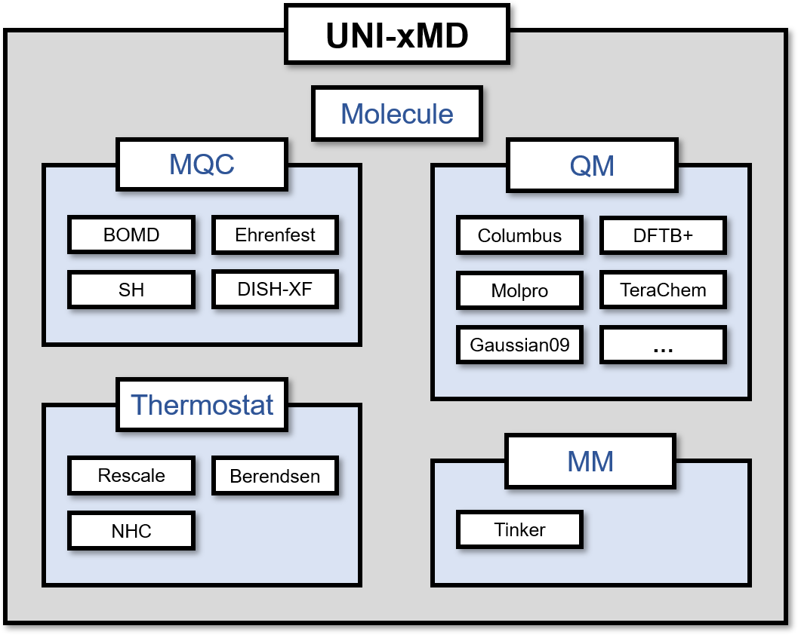

==========================
Build
==========================

UNI-xMD is python based program with a little C code for time-consuming
electronic propagation part interfaced via Cython, therefore compilation is needed.

Requirements
^^^^^^^^^^^^^^^^^^^^^^^^^^

Python 3.6 (or newer)

Numpy

Cython https://cython.org

If you don't have numpy or Cython, you can install them using pip command.

.. code-block:: bash

   $ pip install --upgrade numpy Cython

Compilation
^^^^^^^^^^^^^^^^^^^^^^^^^^

You can compile electronic propagation routine by typing following
command in root directory of the program which contains setup.py file.

.. code-block:: bash

   $ python3 setup.py build_ext -b ./src/build

================================
Code Overview
================================

Program Structure
^^^^^^^^^^^^^^^^^^^^^^^^^^

The overall code structure is displayed in next figure.

UNI-xMD is mainly based on object-oriented programming, which is structured by
several classes closely connected with each other.
Central modules of UNI-xMD can be divided into followings.

- Molecule : Describes overall molecule objects, including state objects.

- MQC : Class for dynamics propagation. Contains subclasses for each method such as Ehrenfest or surface hopping.

- QM : Class for calculating dynamics properties using external software such as Molpro or DFTB+.

- MM : Class for calculating dynamics properties using external software such as Tinker.

- Thermostat : Class for a component which controls the temperature of a physical system.

Subclasses of MQC, QM and MM classes are organized in inheritance structure.
This helps to simplify codes by inheriting common arguments to the subclasses.

For the detailed information of each module, check each section in below.

Working Process
^^^^^^^^^^^^^^^^^^^^^^^^^^

To run UNI-xMD, it requires creating some objects in running script.
A straightfoward way to perform a UNI-xMD calculation is as follows:

**1. First of all, you should add the corresponding directory to your python path.**

.. code-block:: bash

   $ export PYTHONPATH=$UNIXMDHOME/src:$PYTHONPATH
 
**2. You should import some libraries in the running script.**

.. code-block:: python

   from molecule import Molecule
   import qm, mqc
   from thermostat import *
   from misc import data

**3. To run UNI-xMD, you should create several objects in your running script. The important
thing is that the object inherited from** ``Molecule`` **class is created in the first place.**

- Define molecular infomation.

.. code-block:: python

   geom = """
   NUMBER_OF_ATOMS
   TITLE
   SYMBOL  COORDINATES  VELOCITIES
   """

   mol = Molecule(geometry=geom, ARGUMENTS)

.. note:: ``mol`` object should be already created before creating another objects which describe QM, MQC and thermostat.

- Determine electronic structure calculation program and method to get energy, force and nonadiabatic coupling vector.

.. code-block:: python

   qm = qm.QM_prog.QM_method(molecule=mol, ARGUMENTS)

**QM_prog** and **QM_method** are electronic structure calculation program and theory, respectively. They are listed in ???.

- Determine method for dynamics propagation.

.. code-block:: python

   md = mqc.MDTYPE(molecule=mol, ARGUMENTS)

**MDTYPE** can be replaced by BOMD, SH, Eh or SHXF which mean Born-Opphenhimer molecular dynamics, surface hopping,
Ehrenfest dynamics and decoherence induced surface hopping based on exact factorization, respectively.

- Choose a thermostat type. Currently, there are three types for thermostat.

.. code-block:: python

   bathT = THERMOSTAT(temperature=300.0, ARGUMENTS)

**THERMOSTAT** is listed in ???.

- Put your objects into ``run`` method of ``md`` object.

.. code-block:: python

   md.run(molecule=mol, theory=qm, thermostat=bathT, ARGUMENTS)

**4. Execute your running script**

.. code-block:: bash

   $ python3 running_script.py

==========================
Quick Start
==========================

Here, we provide executable running script file, which contains:

.. code-block:: python

   from molecule import Molecule
   import qm, mqc
   from thermostat import *
   from misc import data

   geom = """
   NUMBER_OF_ATOMS
   TITLE
   SYMBOL  COORDINATES  VELOCITIES
   """

   mol = Molecule(geometry=geom, nstates=NSTATES)

   qm = qm.QM_PROG.QM_METHOD(ARGUMENTS)

   md = mqc.MDTYPE(ARGUMETNS)

   bathT = THERMOSTAT(ARGUMENTS)

   md.run(molecule=mol, theory=qm, thermostat=bathT, input_dir=INPUT_DIR)

If you execute this script, you can get output files listed in table:

+-----------+------+--------+----+
|           | BOMD | SH(XF) | Eh |
+===========+======+========+====+
| MDENERGY  | o    | o      | o  |
+-----------+------+--------+----+
| MOVIE.xyz | o    | o      | o  |
+-----------+------+--------+----+
| FINAL.xyz | o    | o      | o  |
+-----------+------+--------+----+
| BOCOH *   | x    | o      | o  |
+-----------+------+--------+----+
| BOPOP *   | x    | o      | o  |
+-----------+------+--------+----+
| NACME     | x    | o      | o  |
+-----------+------+--------+----+
| SHPROB    | x    | o      | x  |
+-----------+------+--------+----+
| SHSTATE   | x    | o      | x  |
+-----------+------+--------+----+

.. note:: \* If you set propagation="density", UNI-xMD provides **BOCOH** and **BOPOP**.
   However, if you set propagation="coefficient", UNI-xMD provides **BOCOEF** rather than **BOCOH** and **BOPOP**.

- MDENERGY : energy which contains kinetic energy, potential energy of each adiabatic state and total energy

.. code-block:: bash

   Here is data

- MOVIE.xyz : geometries at each step

.. code-block:: bash

   Here is data

- FINAL.xyz : geometry at final step

.. code-block:: bash

   Here is data

- BOCOH : off-diagonal term of adiabatic density matrix

.. code-block:: bash

   Here is data

- BOPOP : adiabatic population

.. code-block:: bash

   Here is data

- NACME : nonadiabatic coupling matrix element

.. code-block:: bash

   Here is data

- SHPROB : hopping probability between the adiabatic states

.. code-block:: bash

   Here is data

- SHSTATE : running state

.. code-block:: bash

   Here is data

