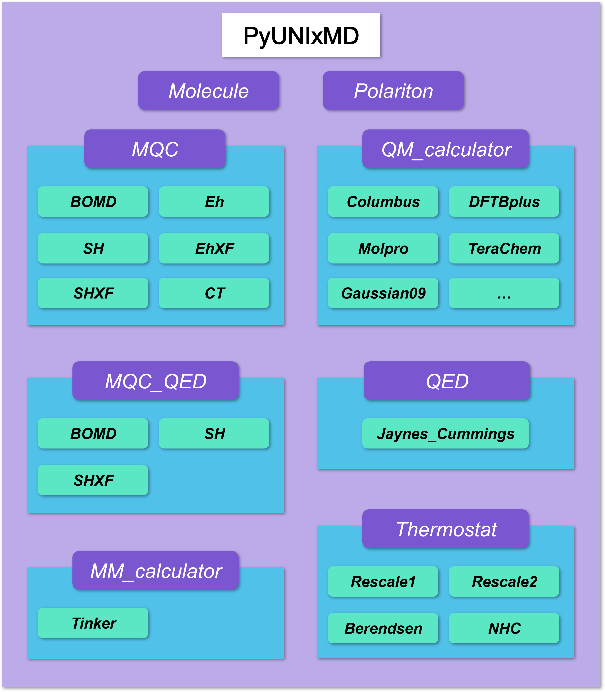

===========================
PyUNIxMD Overview
===========================

Features
---------------------------
The features of PyUNIxMD are as follows.

- Conventional (non)adiabatic dynamics

  -  Born-Oppenheimer molecular dynamics (BOMD)
  -  Ehrenfest dynamics :cite:`Ehrenfest1927`
  -  Fewest switches surface hopping (FSSH) dynamics :cite:`Tully1990` with ad hoc decoherence corrections :cite:`Granucci2010`

.. Padding

- Decoherence based on exact factorization

  -  Decoherence induced surface hopping based on exact factorization (DISH-XF) :cite:`Ha2018`
  -  Coupled-trajectory mixed quantum-classical (CTMQC) method :cite:`Agostini2016`

.. Padding

- Accessible interface to external QM programs and built-in model Hamiltonians

  -  COLUMBUS :cite:`Lischka2011`: SA-CASSCF
  -  Molpro :cite:`Werner2012`: SA-CASSCF
  -  Gaussian 09 :cite:`Frisch2009`: TDDFT
  -  Q-Chem :cite:`qchem2015`: TDDFT
  -  TURBOMOLE :cite:`Ahlrichs1989`: TDDFT
  -  TeraChem :cite:`Ufimtsev2008_1,Ufimtsev2009_1,Ufimtsev2009_2`: SI-SA-REKS (SSR)
  -  DFTB+ :cite:`Hourahine2020`: TDDFTB, DFTB/SSR
  -  Model Hamiltonians: Tully :cite:`Tully1990`, Shin-Metiu :cite:`Shin1995`

.. Padding

- Numerical calculation of time-derivative nonadiabatic couplings (TDNACs) :cite:`Ryabinkin2015`
- QM/MM functionalities
- Utility scripts in Python

Authors
---------------------------
The current version of PyUNIxMD has been developed by Seung Kyu Min, In Seong Lee, Jong-Kwon Ha, Daeho Han, Kicheol Kim, Tae In Kim, Sung Wook Moon in the Theoretical/Computational Chemistry Group for Excited State Phenomena of Ulsan National Institute of Science and Technology (UNIST). 

Citation
---------------------------
Please cite the following work when publishing results from PyUNIxMD program:

\I. S. Lee, J.-K. Ha, D. Han, T. I. Kim, S. W. Moon, & S. K. Min. (2021). PyUNIxMD: A Python-based excited state molecular dynamics package. Journal of Computational Chemistry, 42:1755-1766. 2021

..
  Acknowledgement
  ---------------------------
  This is acknowledgement.

Program Structure
---------------------------
The overall code structure is displayed in the next figure.

PyUNIxMD is an object-oriented program consisting of
several key classes closely connected with each other:

- :class:`Molecule` defines a target system. A molecule object contains information of the electronic states as well as the geometry.

- :class:`MQC` has information about molecular dynamics. Each nonadiabatic dynamics method (Ehrenfest, surface hopping, etc.) comprises its subclasses. 

- :class:`QM_calculator` interfaces several QM programs (Molpro, Gaussian 09, DFTB+, etc.) and methodologies to perform electronic structure calculations.

- :class:`MM_calculator` enables QM/MM calculations using external softwares such as Tinker.

- :class:`Thermostat` controls temperature of a target system.

PyUNIxMD takes advantage of the inheritance feature to organize functionalities and simplify the codes by sharing the common parameters and methods.

For detailed information of each class, see :ref:`PyUNIxMD Objects <Objects>`. 

