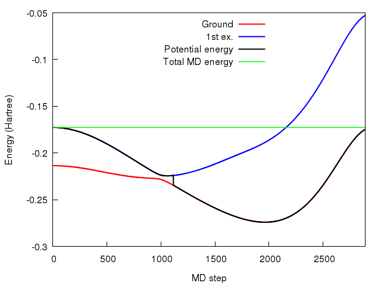
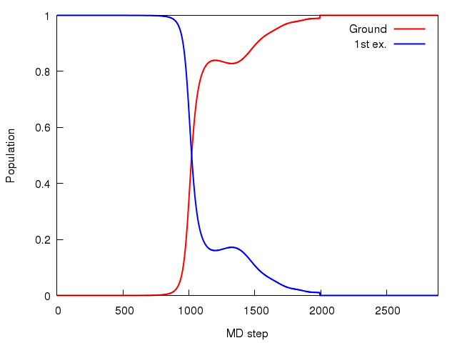
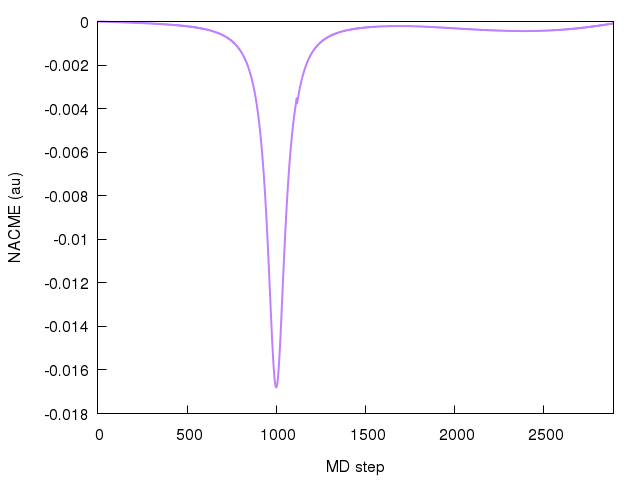
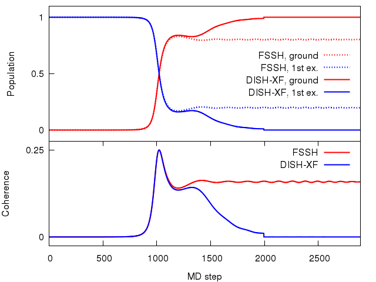

.. _Quick Start:

==========================
Quick Start
==========================

This section gives a simple MD example using PyUNIxMD.

We will perform DISH-XF (decoherence induced surface hopping based on exact factorization) dynamics
on Shin-Metiu model :cite:`Shin1995`, which is a standard model for nonadiabatic charge transfer.

The running script is the following.

.. code-block:: python
   :linenos:

   from molecule import Molecule
   import qm, mqc
   from misc import data
   
   data[f"X1"] = 1836 # au
   import random
   random.seed(10)  
 
   geom = """
   1
   Shin-Metiu model
   X1       -4.0     0.0
   """
   
   mol = Molecule(geometry=geom, ndim=1, nstates=2, ndof=1, unit_pos='au', l_model=True)
   
   qm = qm.model.Shin_Metiu(molecule=mol)
   
   md = mqc.SHXF(molecule=mol, nsteps=2890, nesteps=1, dt=0.5, unit_dt='au', \
        sigma=0.1, istate=1, elec_object="density")
   
   md.run(qm=qm)

**Line 1-3** import the PyUNIxMD packages.

**Line 5** sets the mass of a fictitious particle of the model.

**Line 6-7** set the random seed. This is for you to reproduce the same results here.
DISH-XF is based on FSSH, so the results of a single trajectory are probabilistic. You can also comment out this part to check if the sequence of the random numbers vary.

**Line 9-15** set the system. The position and velocity of the X1 particle is given as -4.0 au and 0.0 au respectively.
The dynamics propagates on 1D space, and two adiabatic states (the ground and the 1st excited states) are considered.

**Line 17** sets the QM method. We chose the Shin-Metiu model among model systems.

**Line 19-20** determine the MD method. DISH-XF method is selected. Initially the particle is on the 1st excited state denoted by **istate** = *1*.

**Line 22** runs the dynamics calculation.

Preparing the above running script, run the dynamics.

.. code-block:: bash

   $ python3 running_script.py

Invoking the command, you will see the standard output.
It shows a summary of the calculation setting you put in the running script, and dynamics information at every time step.
Each printout has its own name tag (INFO, DEBUG1, etc.) so that you can easily use :code:`grep` command.
The meaning of columns of each tagged line is written when the dynamics information part begins.

.. code-block:: bash

   (...)
   ----------------------------------------------------------------------------------------------------------------------
                                                      Start Dynamics
   ----------------------------------------------------------------------------------------------------------------------
    #INFO    STEP  State    Max. Prob.       Rand.     Kinetic(H)   Potential(H)     Total(H)   Temperature(K)   Norm.
    INFO        0    1    0.00000 (1->1)    0.57140    0.00000000    -0.17271176    -0.17271176     0.000000    1.00000
    INFO        1    1    0.00000 (1->0)    0.42889    0.00000008    -0.17271184    -0.17271176     0.050486    1.00000
    INFO        2    1    0.00000 (1->0)    0.57809    0.00000032    -0.17271208    -0.17271176     0.201944    1.00000
    INFO        3    1    0.00000 (1->0)    0.20610    0.00000072    -0.17271248    -0.17271176     0.454373    1.00000
    INFO        4    1    0.00000 (1->0)    0.81332    0.00000128    -0.17271304    -0.17271176     0.807772    1.00000
    INFO        5    1    0.00000 (1->0)    0.82359    0.00000200    -0.17271376    -0.17271176     1.262138    1.00000
    INFO        6    1    0.00000 (1->0)    0.65347    0.00000288    -0.17271464    -0.17271176     1.817467    1.00000
    INFO        7    1    0.00000 (1->0)    0.16023    0.00000392    -0.17271568    -0.17271176     2.473758    1.00000
    INFO        8    1    0.00000 (1->0)    0.52067    0.00000512    -0.17271688    -0.17271176     3.231005    1.00000
    INFO        9    1    0.00000 (1->0)    0.32777    0.00000647    -0.17271824    -0.17271176     4.089203    1.00000
    INFO       10    1    0.00000 (1->0)    0.25000    0.00000799    -0.17271976    -0.17271176     5.048348    1.00000
    INFO       11    1    0.00000 (1->0)    0.95282    0.00000967    -0.17272143    -0.17271176     6.108432    1.00000
    INFO       12    1    0.00000 (1->0)    0.99656    0.00001151    -0.17272327    -0.17271176     7.269450    1.00000
    INFO       13    1    0.00000 (1->0)    0.04456    0.00001351    -0.17272527    -0.17271176     8.531394    1.00000
    INFO       14    1    0.00000 (1->0)    0.86016    0.00001567    -0.17272743    -0.17271176     9.894255    1.00000
    INFO       15    1    0.00000 (1->0)    0.60319    0.00001798    -0.17272975    -0.17271176    11.358024    1.00000
    INFO       16    1    0.00000 (1->0)    0.38161    0.00002046    -0.17273222    -0.17271176    12.922694    1.00000
    (...)

Also, you will obtain the following output files:

- MDENERGY

This file shows MD energies and energies of adiabatic states.
There are only two energy values for the adiabatic states, E(0) and E(1) because you put **nstates** = *2*.

.. code-block:: bash

   #    Step     Kinetic(H)     Potential(H)   Total(H)       E(0)(H)        E(1)(H)   
           0     0.00000000    -0.17271176    -0.17271176    -0.21359101    -0.17271176
           1     0.00000008    -0.17271184    -0.17271176    -0.21359105    -0.17271184
           2     0.00000032    -0.17271208    -0.17271176    -0.21359116    -0.17271208
           3     0.00000072    -0.17271248    -0.17271176    -0.21359136    -0.17271248
           4     0.00000128    -0.17271304    -0.17271176    -0.21359164    -0.17271304
           5     0.00000200    -0.17271376    -0.17271176    -0.21359199    -0.17271376
           6     0.00000288    -0.17271464    -0.17271176    -0.21359242    -0.17271464
           7     0.00000392    -0.17271568    -0.17271176    -0.21359293    -0.17271568
           8     0.00000512    -0.17271688    -0.17271176    -0.21359352    -0.17271688
           9     0.00000647    -0.17271824    -0.17271176    -0.21359419    -0.17271824
          10     0.00000799    -0.17271976    -0.17271176    -0.21359493    -0.17271976
          11     0.00000967    -0.17272143    -0.17271176    -0.21359576    -0.17272143
          12     0.00001151    -0.17272327    -0.17271176    -0.21359666    -0.17272327
          13     0.00001351    -0.17272527    -0.17271176    -0.21359764    -0.17272527
          14     0.00001567    -0.17272743    -0.17271176    -0.21359870    -0.17272743
          15     0.00001798    -0.17272975    -0.17271176    -0.21359984    -0.17272975
          16     0.00002046    -0.17273222    -0.17271176    -0.21360106    -0.17273222
          17     0.00002310    -0.17273486    -0.17271176    -0.21360235    -0.17273486
          18     0.00002590    -0.17273766    -0.17271176    -0.21360373    -0.17273766
          19     0.00002885    -0.17274061    -0.17271176    -0.21360518    -0.17274061
          20     0.00003197    -0.17274373    -0.17271176    -0.21360671    -0.17274373
   (...)

If you plot a energy-MD step graph with the values, it looks like the following.

The potential energy shows a "hop" near the avoided crossing, while the total MD energy is conserved.

- MOVIE.xyz

This file contains the position and the velocity of the particle at each MD step.

.. code-block:: bash

        1
     Step:     0            Position(A)                                  Velocity(au)
   X1       -2.11670900     0.00000000
        1
     Step:     1            Position(A)                                  Velocity(au)
   X1       -2.11670776     0.00000933
        1
     Step:     2            Position(A)                                  Velocity(au)
   X1       -2.11670406     0.00001866
        1
     Step:     3            Position(A)                                  Velocity(au)
   X1       -2.11669789     0.00002800
        1
     Step:     4            Position(A)                                  Velocity(au)
   X1       -2.11668924     0.00003733
   (...)

- FINAL.xyz

This file contains the position and the velocity of the final MD step.

.. code-block:: bash

        1
     Step:  2890            Position(A)                                  Velocity(au)
   X1        3.32357102     0.00152546

- BOPOP

This file shows the adiabatic populations.

.. code-block:: bash

   #     Density Matrix: population Re; see the manual for detail orders
           0     0.00000000     1.00000000
           1     0.00000000     1.00000000
           2     0.00000000     1.00000000
           3     0.00000000     1.00000000
           4     0.00000000     1.00000000
           5     0.00000000     1.00000000
           6     0.00000000     1.00000000
           7     0.00000000     1.00000000
           8     0.00000000     1.00000000
           9     0.00000000     1.00000000
   (...)
        1110     0.80427175     0.19572825
        1111     0.80530983     0.19469017
        1112     0.80632251     0.19367749
        1113     0.80731030     0.19268970
        1114     0.80827368     0.19172632
        1115     0.80921314     0.19078686
        1116     0.81009964     0.18990036
        1117     0.81104810     0.18895190
        1118     0.81197284     0.18802716
        1119     0.81287440     0.18712560
        1120     0.81375331     0.18624669
   (...)
        2880     0.99998268     0.00001732
        2881     0.99998302     0.00001698
        2882     0.99998337     0.00001663
        2883     0.99998372     0.00001628
        2884     0.99998407     0.00001593
        2885     0.99998442     0.00001558
        2886     0.99998477     0.00001523
        2887     0.99998512     0.00001488
        2888     0.99998546     0.00001454
        2889     0.99998580     0.00001420
        2890     0.99998614     0.00001386

The population changes when the particle passes the avoided crossing
and the electronic state eventually collapses to the ground state due to the decoherence correction.
The electronic coefficients are to be reset when the density matrix becomes diagonal, that is, an adiabatic state is recovered during the dynamics.
In this case, the reset happened near Step 2000.
If you plot them as a function of MD steps, it looks like the following.

- BOCOH

This file shows off-diagonal elements of the density matrix, 
so there are only two columns for real and imaginary components of the one off-diagonal element when **nstates** = *2*. 

.. code-block:: bash

   #     Density Matrix: coherence Re-Im; see the manual for detail orders
           0     0.00000000     0.00000000
           1     0.00000000     0.00000000
           2     0.00000013    -0.00000000
           3     0.00000040    -0.00000001
           4     0.00000079    -0.00000002
           5     0.00000132    -0.00000004
           6     0.00000197    -0.00000007
           7     0.00000276    -0.00000012
           8     0.00000368    -0.00000019
           9     0.00000473    -0.00000027
   (...)
        1110     0.26768393    -0.29295544
        1111     0.26503720    -0.29427900
        1112     0.26238625    -0.29559935
        1113     0.25973087    -0.29691633
        1114     0.25707089    -0.29822977
        1115     0.25440609    -0.29953952
        1116     0.25175133    -0.30086314
        1117     0.24898586    -0.30218251
        1118     0.24621450    -0.30349715
        1119     0.24343700    -0.30480680
        1120     0.24065311    -0.30611125
   (...)
        2880     0.00329890     0.00253652
        2881     0.00339667     0.00233222
        2882     0.00348245     0.00212230
        2883     0.00355592     0.00190750
        2884     0.00361681     0.00168860
        2885     0.00366490     0.00146636
        2886     0.00369999     0.00124157
        2887     0.00372196     0.00101502
        2888     0.00373072     0.00078753
        2889     0.00372624     0.00055990
        2890     0.00370853     0.00033293

You can consider (de)coherence indicators given as the magnitude squares of the off-diagonal element.
If you plot them as a function of MD steps, it looks like the following.

.. image:: diagrams/pcoh.png
   :width: 400pt

- NACME

This file shows the nonadiabatic coupling matrix elements.
You can check that there are finite values when the particle passes the avoided crossing.

.. code-block:: bash

   #    Non-Adiabatic Coupling Matrix Elements: off-diagonal
            0     0.00000000
            1    -0.00000026
            2    -0.00000053
            3    -0.00000079
            4    -0.00000105
            5    -0.00000132
            6    -0.00000158
            7    -0.00000185
            8    -0.00000211
            9    -0.00000237
   (...)
          990    -0.01638578
          991    -0.01646735
          992    -0.01654045
          993    -0.01660486
          994    -0.01666035
          995    -0.01670674
          996    -0.01674388
          997    -0.01677165
          998    -0.01678995
          999    -0.01679871
         1000    -0.01679791
   (...)

If you plot them as a function of MD steps, it looks like the following.

- SHPROB

This file shows the hopping probabilities from the running state to the others at each MD step.
You can check the running state from 'SHSTATE' file.

.. code-block:: bash

   #    Step        Prob(0)        Prob(1)
           0    -0.00000000     0.00000000
           1     0.00000000     0.00000000
           2     0.00000000     0.00000000
           3     0.00000000     0.00000000
           4     0.00000000     0.00000000
           5     0.00000000     0.00000000
           6     0.00000000     0.00000000
           7     0.00000000     0.00000000
           8     0.00000000     0.00000000
           9     0.00000000     0.00000000
   (...)
        1110     0.00513368     0.00000000
        1111     0.00503911     0.00000000
        1112     0.00494556     0.00000000
        1113     0.00485301     0.00000000
        1114     0.00476146     0.00000000
        1115     0.00467091     0.00000000
        1116     0.00000000     0.00000000
        1117     0.00000000     0.00000000
        1118     0.00000000     0.00000000
        1119     0.00000000     0.00000000
        1120     0.00000000     0.00000000
   (...)

- SHSTATE

This file shows the running state at each MD step.

.. code-block:: bash
   
   #    Step    Running State
           0              1
           1              1
           2              1
           3              1
           4              1
           5              1
           6              1
           7              1
           8              1
           9              1
   (...)
        1110              1
        1111              1
        1112              1
        1113              1
        1114              1
        1115              0
        1116              0
        1117              0
        1118              0
        1119              0
        1120              0
   (...)

You can check the effect of the decoherence by performing a FSSH calculation
by changing the MD setting in the above running script:

.. code-block:: python

   md = mqc.SH(molecule=mol, nsteps=2890, nesteps=1, dt=0.5, unit_dt='au', \
        istate=1, elec_object="density")

Then the populations and the coherence will be shown like this.

