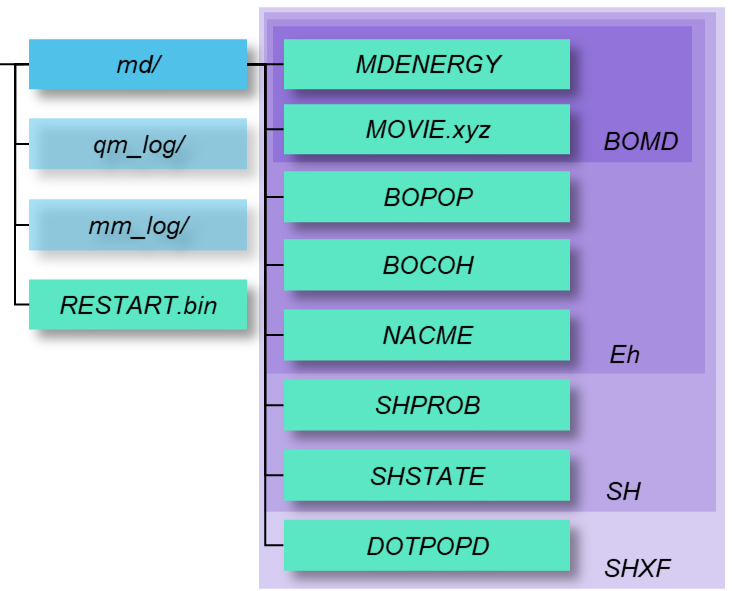

==========================
Workflow
==========================
Here, we explain how to run MD calculations with PyUNIxMD.

You will make a running script for the MD calculation you want to perform. In your running script, you will create PyUNIxMD objects successively.
A typical template of the running script is the following:

.. code-block:: python
   :linenos:

   from molecule import Molecule
   import qm, mqc
   import thermostat

   geom = """
   <number of atoms>
   <comment>
   <symbol> <X> <Y> <Z> <V_X> <V_Y> <V_Z>
   <symbol> <X> <Y> <Z> <V_X> <V_Y> <V_Z>
   ...
   <symbol> <X> <Y> <Z> <V_X> <V_Y> <V_Z>
   """

   mol = Molecule(geometry=geom, nstates=NSTATES)

   qm = qm.QM_PROG.QM_METHOD(ARGUMENTS)

   bathT = thermostat.THERMO_TYPE(ARGUMENTS)

   md = mqc.MD_TYPE(molecule=mol, thermostat=bathT, ARGUMENTS)

   md.run(qm=qm, ARGUMENTS)

**Line 1-3** import the PyUNIxMD packages for the below jobs.

**Line 5-14** set a target system you are interested in.
You need to prepare a string as an argument to specify initial geometry and velocities in extended XYZ format.
NSTATES means the number of adiabatic states considered in the dynamics calculations.
See :ref:`Molecule <Objects Molecule>` for the list of parameters.

.. note:: The ``mol`` object must be created first because it will be used for making other objects.

**Line 16** determines an electronic structure calculation program and its method to obtain QM information
such as energies, forces, and nonadiabatic coupling vectors. QM_PROG is the directory name where the QM interface
package is. QM_METHOD is a name of Python class specifying one of QM methods provided with that interface package.
See :ref:`QM_calculator <Objects QM_calculator>` for the list.

**Line 18** sets a thermostat. THERMO_TYPE is a name of Python class specifying how to control temperature. See :ref:`Thermostat <Objects Thermostat>` for the list. 

**Line 20** determines a dynamics method you want to use. MD_TYPE is a name of Python class specifying one of MQC methods (BOMD, Eh, SH, SHXF). See :ref:`MQC <Objects MQC>` for the details.

**Line 22** runs the dynamics calculation. 

Finally, you will execute your running script.

.. code-block:: bash

   $ python3 running_script.py

Running MD calculations with PyUNIxMD, you will obtain output files under the following file tree.

The blue and light green boxes represent directories and files, respectively. The purple shades distinguish output files that vary according to the MQC methods.

'md/' collects MD outputs, and 'qm_log/' and 'mm_log/' have logs of QM and MM calculations, respectively
(The latter two directories are optional). 'RESTART.bin' is a binary used to restart a dynamics calculation. See :ref:`MQC<Objects MQC>` for the details.

.. note:: Since default of **l_print_dm** is *True*, thus PyUNIxMD provides 'BOCOH' and 'BOPOP' regardless of **elec_object**.
   If **elec_object** is *"coefficient"* and you set **l_print_dm** to *False*, then the outputs 'BOCOH' and 'BOPOP' are not written anymore.

Details of the MD output files and their formats are the following.

- MDENERGY

This file shows MD energies and energies of adiabatic states.

.. code-block:: bash

   <MD step>   <kinetic energy>   <potential energy>   <total MD energy>   <adiabatic energy 0>   <adiabatic energy 1> ... <adiabatic energy last>
   <MD step>   <kinetic energy>   <potential energy>   <total MD energy>   <adiabatic energy 0>   <adiabatic energy 1> ... <adiabatic energy last>
   ...

- MOVIE.xyz

This file contains positions and velocities at each MD step (a trajectory).
For the ease of visualization, those snapshots are written chronically in the extended XYZ format.

.. code-block:: bash

   <number of atoms>
   Step:     0
   <symbol> <X> <Y> <Z> <V_X> <V_Y> <V_Z>
   <symbol> <X> <Y> <Z> <V_X> <V_Y> <V_Z>
   ...
   <number of atoms>
   Step:     1
   <symbol> <X> <Y> <Z> <V_X> <V_Y> <V_Z>
   <symbol> <X> <Y> <Z> <V_X> <V_Y> <V_Z>
   ...

- FINAL.xyz

This file contains the final position and velocity of an MD calculation.

.. code-block:: bash

   <number of atoms>
   Step:    <last MD step>
   <symbol> <X> <Y> <Z> <V_X> <V_Y> <V_Z>
   <symbol> <X> <Y> <Z> <V_X> <V_Y> <V_Z>
   ...
   <symbol> <X> <Y> <Z> <V_X> <V_Y> <V_Z>

- BOPOP

This file shows the adiabatic populations (diagonal elements of the density matrix) at each MD step.

.. code-block:: bash

   <MD step> <population of state 0> <population of state 1> ... <population of last state> 
   <MD step> <population of state 0> <population of state 1> ... <population of last state> 
   ... 

- BOCOH 

This file shows off-diagonal elements of the density matrix at each MD step. Only the upper triangular portions are given because of hermiticity. The real and imaginary part of each element are written alternately.

.. code-block:: bash

   <MD step> <Re. element 0, 1> <Im. element 0, 1> <Re. element 0, 2> <Im. element 0, 2> ... <Re. element last-1, last> <Im. element last-1, last> 
   <MD step> <Re. element 0, 1> <Im. element 0, 1> <Re. element 0, 2> <Im. element 0, 2> ... <Re. element last-1, last> <Im. element last-1, last> 
   ... 

- NACME

This file shows nonadiabatic coupling matrix elements at each MD step. Only the upper triangular portions are given because of antihermiticity.

.. code-block:: bash

   <MD step> <element 0, 1> <element 0, 2> ... <element last-1, last> 
   <MD step> <element 0, 1> <element 0, 2> ... <element last-1, last> 
   ... 

- SHPROB

This file shows hopping probabilities from the running state to the others at each MD step.

.. code-block:: bash

   <MD step> <P(running -> 0)> <P(running -> 1)> ... <P(running -> last)>
   <MD step> <P(running -> 0)> <P(running -> 1)> ... <P(running -> last)>
   ... 

- SHSTATE

This file shows the running state at each MD step.

.. code-block:: bash

   <MD step> <running>
   <MD step> <running>
   ... 

For a quick test of PyUNIxMD, see :ref:`Quick Start<Quick Start>` . Also, you can refer to scripts and log files in '$PYUNIXMDHOME/examples/' directory for practical calculations.

